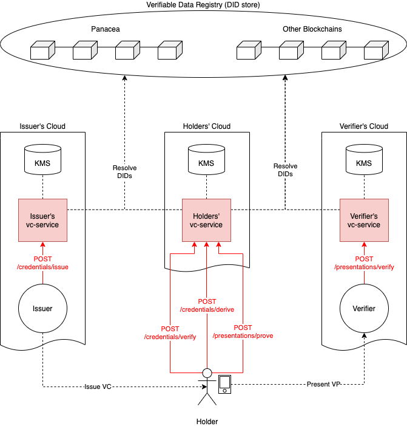

# VerifiableCredential Service

A REST service for signing/verifying VerifiableCredential/Presentation

## Features

- Signing [VerifiableCredential](https://www.w3.org/TR/vc-data-model/) / [VerifiablePresentation](https://www.w3.org/TR/vc-data-model/#presentations-0)
	- using private keys stored in AWS Parameter Store (pluggable)
- Deriving VerificationCredential for selective disclosure
	- by [Zero-Knowledge Proof](https://www.w3.org/TR/vc-data-model/#zero-knowledge-proofs) using [BBS+ signature](https://w3c-ccg.github.io/ldp-bbs2020/)
- Verifiying VerificationCredential / VerifiablePresentation

## Architecture

The following diagram is a sample architecture using `vc-service`s by each party (issuer, holder and verifier).



According to business requirements of each party, their architectures can be changed.
For example, the issuer and holders can use the same `vc-service` if the holder's app is tightly coupled with the issuer in the business point of view.
Or, verifiers can present a mobile app which scans QR codes of holders.
**The `vc-service` is designed as general as possible, so that it can be used for various architectures in decentralized environments.**

Also, the `vc-service` has pluggable designs.
- can resolve DIDs from various VDR (Verifiable Data Registry).
	- Currently, only Panacea blockchain is supported.
- can store private keys into various KMS (Key Management System).
	- Currently, only AWS Parameter Store is supported.


## Building / Running

```bash
go build ./...
```

To be described


## REST API

To be described
